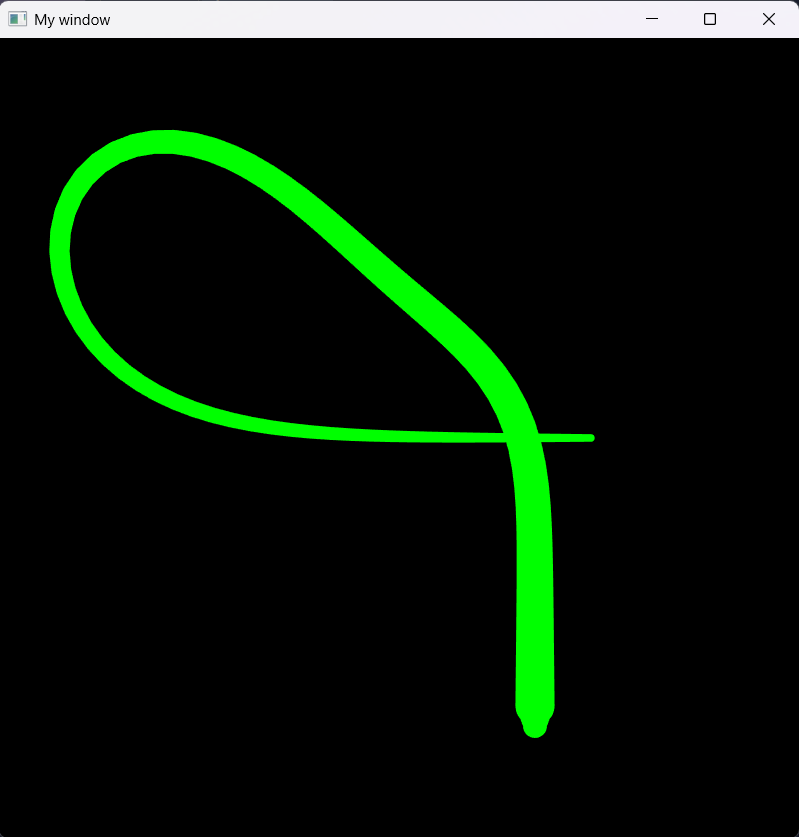

# 🐍 Procedural Snake – SFML Motion Demo

A visually engaging and mathematically clean snake simulation built using **C++ and SFML**. This project demonstrates constraint-based procedural animation where each body segment follows the head using vector math and spacing constraints, producing smooth, lifelike movement.

---

## 📸 Demo Preview



> Make sure to place your screenshot as `snake_demo.png` in an `images` folder next to this README.

---

## 🎮 Features

- Directional snake movement using keyboard input
- Smooth, constraint-based body follow-through animation
- Convex body mesh rendering with circular tips
- Adjustable speed control and pause/resume functionality

---

## 🧪 Tech Stack

- **C++**
- **SFML 2.x**
- STL: `vector`, `optional`, and `cmath`
- Procedural shape rendering and real-time motion logic

---

## ⚙️ Controls

| Key                | Action               |
|--------------------|----------------------|
| `W`, `A`, `S`, `D` | Move snake            |
| `↑` / `↓`          | Increase / decrease speed |
| `Space`            | Pause / resume        |

---

## 🚀 Build & Run

Ensure SFML is installed and linked correctly.

```bash
g++ -std=c++20 main.cpp -o snake -lsfml-graphics -lsfml-window -lsfml-system
./snake
